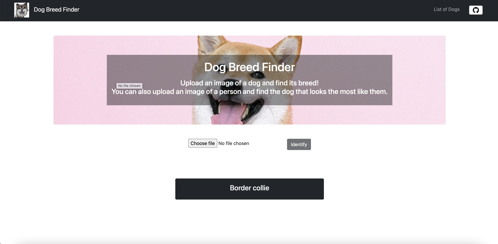
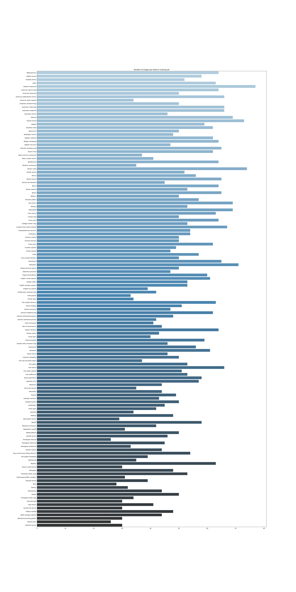
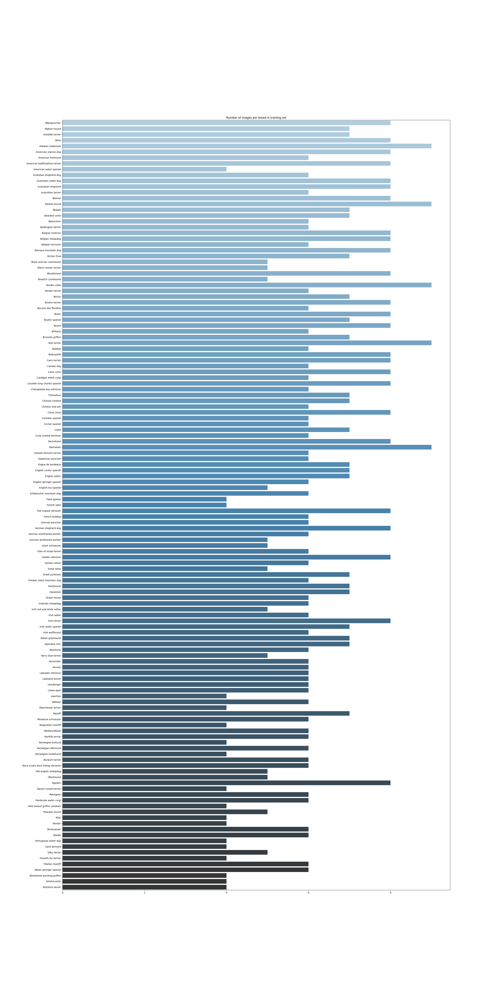

# [Dog Breed Finder](https://dogbreedfinder.app/)

# Table of Contents
1. [Installation](README.md#installation)
2. [Run instructions](README.md#run-instructions)
3. [Project organization](README.md#file-description)
4. [Project overview](README.md#project-overview)
5. [Licensing, Authors and Acknowledgements](LICENSE)

## Installation
### 1. Clone repository

    `
    git clone git@github.com:shiflux/DogBreed-CNN.git
    `

### 2. Install python requirements

    '
    cd DogBreed-CNN
    pip3 install -r requirements.txt
    pip3 install tensorflow-cpu
    '

### 3. Install node dependencies

    '
    cd web/
    npm install
    '

## Run instructions
### 1.1 Run api service

    `
    python3 server.py
    `

### 1.2 Run web service

    `
    npm run dev
    `

### 2. Create and train model

    `
    python3 create_model.py
    `

## Project organization
- **cnn/** Contains the CNN model
- **web/** Contains web service built with NextJS

# Project overview
This is a project for the Udacity "Data Scientist" nanodegree.

CNN models were the the part that struck me the most, and owning a dog, the choice of the project was a no brainer.

We're using the CNN to classify the images of dogs. We're also taking advantage of transfer learning, in this case byt taking a pre-trained CNN model used in a similiar scenario (ResNet50). This helps us get better accuracy and less training time to get better accuracy.

Below the distribution of the data.

We're using accuracy as a metric to evaluate the models: it could seem to be a bad choice because the training data is unbalances, but in this case we have a high number of classes (133).

The images can have different type of dimensions: to use the Resnet50 model, we need first to convert the image to (224, 224). Then we pass all the images to the ResNet50 model and extract the features.
We then use these features as an input of our model. This makes it so the last convolutional layer of the ResNet50 is fed to our mode.
We keep the best model, and in our case it has an accuray of 81%.

The results could be better improved by using a different pre-trained model.